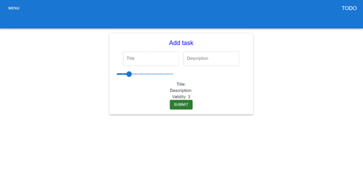
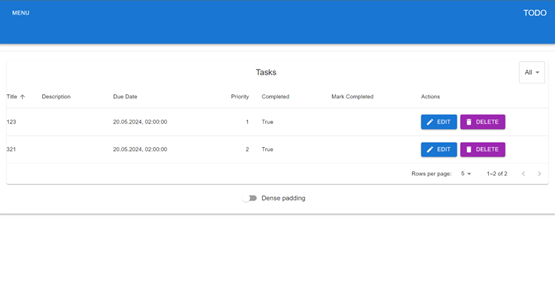

# To-Do Web Application Documentation

**Author:** Mateusz Ambroży 264240

---

## 1. Introduction

The To-Do application is developed as a web project using Java, PostgreSQL, React, Material-UI, and Spring. The application's purpose is to enable users to add, edit, and delete tasks.

## 2. Architecture

### a) Backend

The backend of the application is written in Java using the Spring framework. The main components of the backend are:

- **Spring Boot**: The application server.
- **Spring Data JPA**: Facilitates interaction with the PostgreSQL database.
- **PostgreSQL**: Relational database storing task information.

### b) Frontend

The frontend of the application is built using React and Material-UI. The main components of the frontend are:

- **React**: A JavaScript library for building user interfaces.
- **Material-UI**: A set of UI components for React that provides a modern look to the application.

## 3. Functionality

### 3.1. Adding Tasks

Users can add new tasks through a form on the main page. After entering the data, the form sends a POST request to the backend, which saves the new task in the database.

### 3.2. Editing Tasks

Each task on the list has an edit button that allows users to modify the task details. The edit form sends a PUT request to the backend, updating the data in the database.

### 3.3. Deleting Tasks

Each task on the list has a delete button that allows users to remove the task. A DELETE request is sent to the backend, removing the task from the database.

## 4. Backend and Frontend Separation

### 4.1. Backend

- **Controller Layer**: Receives HTTP requests and forwards them to the appropriate services.
- **Service Layer**: Contains the business logic of the application.
- **Repository Layer**: Handles interactions with the database using Spring Data JPA.

### 4.2. Frontend

- **React Components**: Structure the user interface.
- **Material-UI**: Provides styling and interactive components.
- **Axios**: A library for making HTTP requests to the backend.

## 5. Summary

The To-Do application combines backend and frontend technologies, offering users an intuitive and functional interface for task management. The use of React, Material-UI, Spring Boot, and PostgreSQL provides a solid foundation for further development and scaling of the application.

---

This documentation provides an overview of the To-Do web application's structure, functionality, and technology stack. It serves as a guide for understanding the application's components and their interactions.
